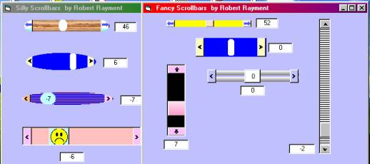



## Fancy Scrollbars

### Description

Fancy Scrollbars by Robert Rayment. If wanted, the purpose here is to get away from the standard VB scrollbars and add other colors, shaping & effects. Lots of examples included to show almost unlimited design possibilities. One reusable bas Module provided & a set of short fixed Subs to include on the Form containing the scrollbars. No extra dependencies & just one recommended API (Sleep). Full instructions given. (exe WinXP) Win98, Zip 39 KB.
 
### More Info
 
See notes

             |
---                |---
**Submitted On**   |2003-06-01 09:53:30
**By**             |[Robert Rayment](https://github.com/Planet-Source-Code/PSCIndex/blob/master/ByAuthor/robert-rayment.md)
**Level**          |Beginner
**User Rating**    |5.0 (45 globes from 9 users)
**Compatibility**  |VB 6\.0
**Category**       |[Graphics](https://github.com/Planet-Source-Code/PSCIndex/blob/master/ByCategory/graphics__1-46.md)
**World**          |[Visual Basic](https://github.com/Planet-Source-Code/PSCIndex/blob/master/ByWorld/visual-basic.md)
**Archive File**   |[Fancy\_Scro159488612003\.zip](https://github.com/Planet-Source-Code/robert-rayment-fancy-scrollbars__1-45869/archive/master.zip)

### API Declarations

Sleep (+optional)

